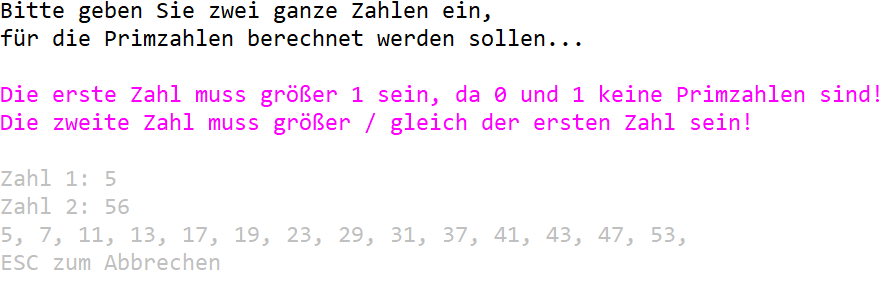

Erstellen Sie ein C# Konsolen-Projekt welches von zwei eingegebenen Zahlen, alle Primzahlen von Zahl1 bis Zahl2 ausgibt.

Verwenden Sie dazu die Funktion / Methode CalculatePrimeNumbers(int from, int to) : string[];

Gestalten Sie die Eingabe der Zahlenwerte und die Ausgabe nach folgendem Schema:

Wird nach der ersten Abarbeitung ESC gedrückt beendet das Programm, ansonsten startet es wieder neu.
